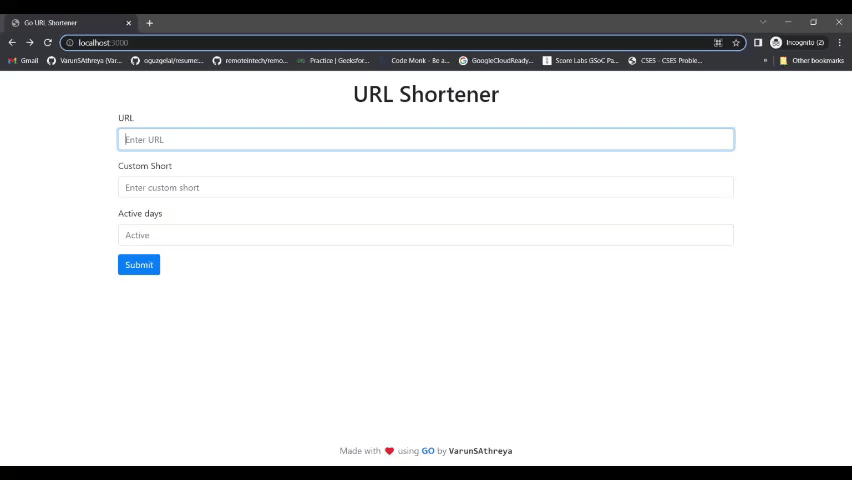

# URL Shortener

## Description

The project is a simple URL shortener that allows you to shorten your long URLs.

## Requirements

- [Go](https://go.dev)
- [Redis](https://redis.io)

## Installation

### Install Dependencies

```bash
    go get
```

### Run the Server

```bash
    go run main.go
```

#### Hot Reload

Install [air](https://github.com/cosmtrek/air)

```bash
    go install github.com/cosmtrek/air@latest
```

Run:

```bash
    air
```

### Apis

- [POST /api/v1](/api/v1)
  - body:
    - url: Required, string, url to shorten
    - short: Optional, string, custom short url
    - expire: Optional, int, expire time in days

- [Get /"short"](/<short>)
  - redirect to original url

### Demo


